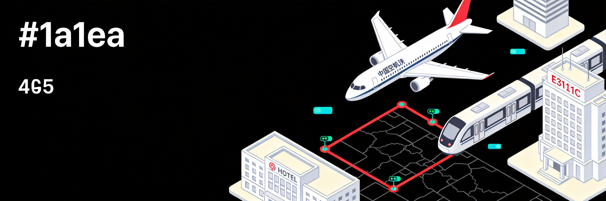
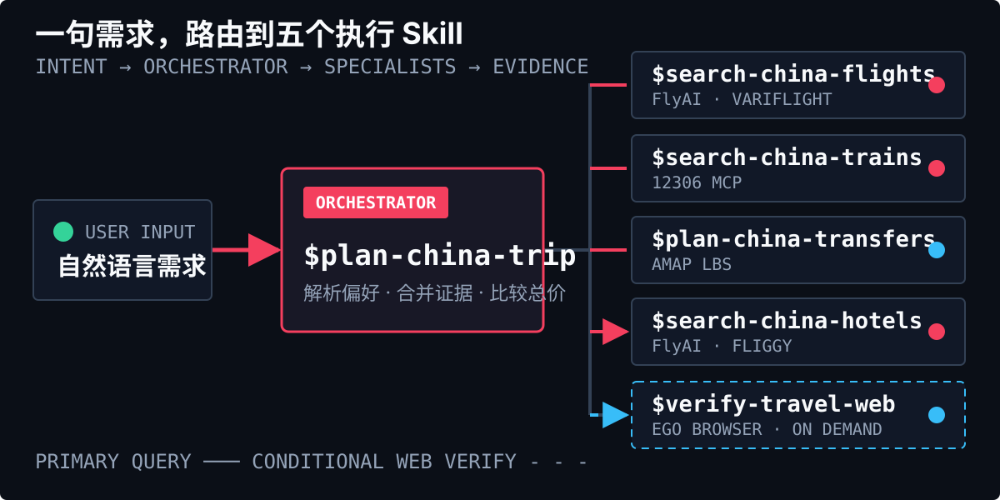
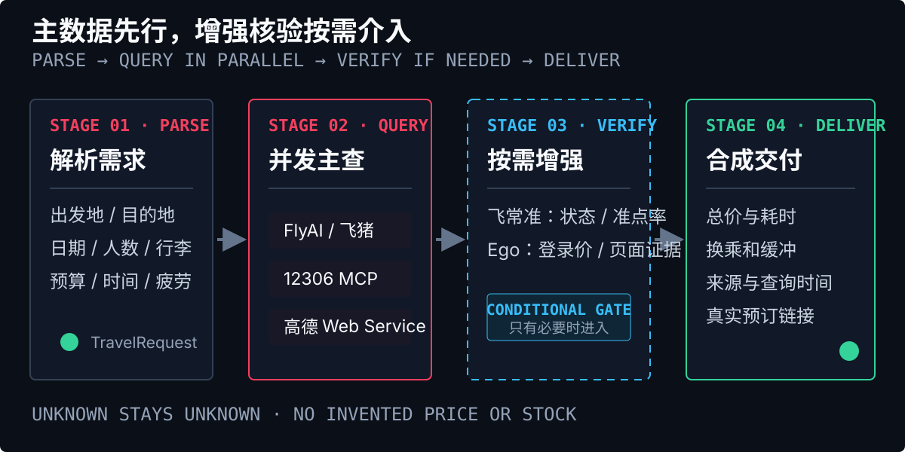
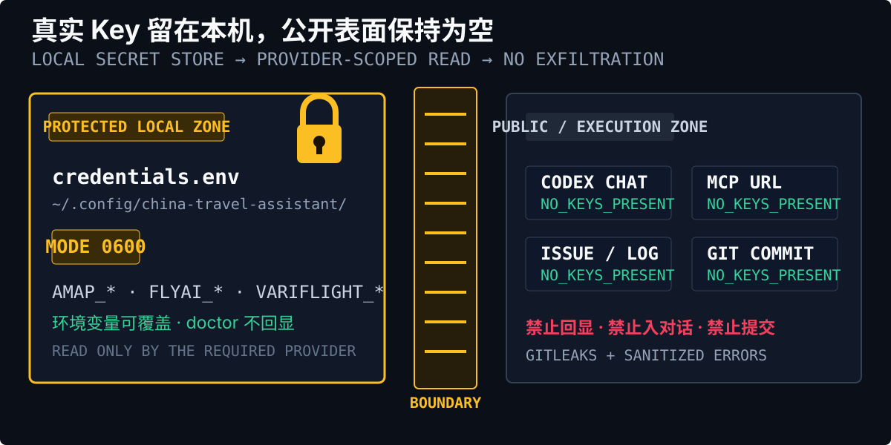
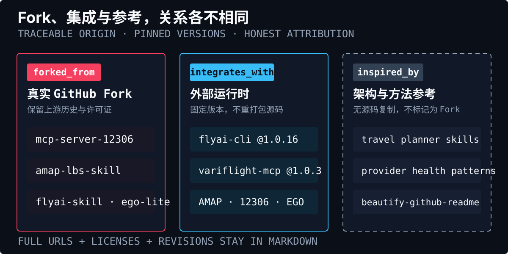

<p align="center">
  
</p>

<h1 align="center">中国出行助手</h1>

<p align="center">
  面向 Codex 的中国境内出行规划 Plugin：用对话组合机票、12306 火车票、酒店、高德接驳和城区公共交通。
</p>

<p align="center">
  <a href="https://github.com/19Chris19/china-travel-assistant/actions/workflows/ci.yml">CI</a> ·
  <a href="https://github.com/19Chris19/china-travel-assistant/releases/tag/v0.1.0">Release v0.1.0</a> ·
  <a href="./LICENSE">MIT License</a> ·
  <a href="https://github.com/19Chris19/china-travel-assistant/issues">Issues</a>
</p>

<p align="center">
  <picture>
    <source media="(prefers-color-scheme: dark)" srcset="./assets/readme/china-travel-assistant-dark.jpeg">
    <source media="(prefers-color-scheme: light)" srcset="./assets/readme/china-travel-assistant-light.jpeg">
    
  </picture>
</p>

<h2 id="quickstart">快速开始</h2>

<p align="center">
  
</p>

要求 Python 3.10+、`pipx`、Node.js、`uvx`、Codex，以及已安装并可运行的 [Ego Browser](https://github.com/citrolabs/ego-lite)。

```bash
git clone https://github.com/19Chris19/china-travel-assistant
cd china-travel-assistant
./scripts/install-local.sh
```

安装后完全退出并重启 Codex，使 Plugin 与 MCP 正式重载。然后运行凭据初始化：

```bash
./scripts/setup-credentials.sh
travel-assistant doctor
```

第一句对话可以直接这样发：

```text
使用 $plan-china-trip，帮我比较沈阳到苏州周边机场的低价航班，
把机场到苏州工业园区的公共交通接驳和总价一起算清楚。
```

默认 `doctor` 只检查本地配置、版本和运行时，不发送付费 API 请求；明确同意后才运行 `travel-assistant doctor --live`。

<h2 id="routing">能力路由</h2>

<p align="center">
  
</p>

顶部 GIF 展示的是本项目的核心思路：先分别查询交通和住宿，再把航班、铁路、机场/车站接驳与酒店组合成可比较的行程。六个 Skills 可以由父 Skill 自动路由，也可以显式调用：

<p align="center">
  
</p>

| Skill | 负责什么 | 主数据源 |
| --- | --- | --- |
| `$plan-china-trip` | 解析需求、路由供应商、合并证据、比较总价 | 全部已启用能力 |
| `$search-china-flights` | 国内航班、周边机场、票价和时间窗口 | FlyAI/飞猪 CLI；飞常准按需核验 |
| `$search-china-trains` | 12306 直达、换乘、余票、票价和链接 | 12306 MCP |
| `$plan-china-transfers` | POI 消歧、机场/车站接驳、公交地铁和步行 | 高德 Web Service 适配器 |
| `$search-china-hotels` | 酒店、房型、登录价、库存和取消条件 | FlyAI/飞猪；Ego Browser 页面核验 |
| `$verify-travel-web` | 页面证据、登录态交接和用户接管 | Ego Browser |

租房搜索不在 v1 运行时中，相关能力计划在 v2 以原创适配器重新加入。

### 数据源如何协作

<p align="center">
  
</p>

```text
自然语言需求
    -> plan-china-trip
    -> FlyAI / 12306 / 高德
    -> 飞常准按需增强
    -> Ego Browser 仅核验登录价或页面证据
    -> 统一总价、时间、缓冲和不确定字段
    -> 输出比较结果与真实平台链接
```

FlyAI 在本项目中是调用飞猪服务的 CLI，不是注册到 Codex 的直接 MCP。浏览器自动化只允许使用 Ego Browser；Kimi WebBridge、Chrome Control、Playwright 和旧租房 Skills 不属于 v1 调用链。

所有动态价格必须带来源和查询时间。缺失的票价、库存、行李或退改字段保持为“未返回”，不推断为已含税或有余票。

<h2 id="security">配置安全</h2>

<p align="center">
  
</p>

只把真实值写入本机的 `~/.config/china-travel-assistant/credentials.env`，权限必须为 `0600`。不要把 Key 写进命令行参数、MCP URL、README、截图、Issue、HTML 或日志。完整步骤、变量映射和错误分类见 [`credentials.md`](plugins/china-travel-assistant/references/credentials.md)。

| 提供商 | 官方申请/配置入口 | 变量 | 用途 |
| --- | --- | --- | --- |
| 高德 Web Service | [创建项目与 Key](https://lbs.amap.com/api/webservice/create-project-and-key) | `AMAP_WEBSERVICE_KEY` | POI、公交、驾车、步行等路线 |
| 高德 JS API | [JS API v2 前置准备](https://lbs.amap.com/api/javascript-api-v2/prerequisites) | `AMAP_JSAPI_KEY`、`AMAP_SECURITY_CODE` | 可选交互地图；不是路线服务必需项 |
| FlyAI / 飞猪 | [FlyAI Open Platform](https://open.fly.ai/) | `FLYAI_API_KEY` | 航班和酒店的增强访问；CLI 版本固定为 `@fly-ai/flyai-cli@1.0.16` |
| 飞常准 | [Variflight AI Open Platform](https://ai.variflight.com/) | `VARIFLIGHT_API_KEY` | 按需核验航班状态、准点率或价格；受额度和账户权限影响 |
| Vigolive | 供应商账户 | `VIGOLIVE_API_KEY` | 仅 v2 租房预留，v1 不读取 |

12306 公共查询不要求 API Key；本项目使用固定提交的 [12306 MCP Fork](https://github.com/19Chris19/mcp-server-12306)。Ego Browser 的登录态由其独立应用管理，不写入本项目凭据文件。

<p align="center">
  
</p>

### 给 Codex 的一键部署提示词

将下面整段交给 Codex、Claude Code 或其他支持本地 Agent Skill 的工具。它会先检查环境和文件，再安装；不会索要、回显或提交真实 Key。

<details>
<summary>展开部署提示词</summary>

```text
请在当前机器部署以下仓库：
https://github.com/19Chris19/china-travel-assistant

1. 克隆仓库并阅读 README.md、SECURITY.md、THIRD_PARTY_NOTICES.md、provenance.yml 和 upstream-lock.yml。
2. 检查 Python 3.10+、pipx、Node.js、npm、uvx、Codex，以及 Ego Browser 是否可用；缺少依赖时只安装公开版本，不读取或打印任何凭据。
3. 运行 ./scripts/install-local.sh。
4. 运行 ./scripts/setup-credentials.sh，创建 ~/.config/china-travel-assistant/credentials.env，并确认权限为 0600。
5. 只提示我在本地填写已经轮换过的 AMAP_WEBSERVICE_KEY、AMAP_JSAPI_KEY、AMAP_SECURITY_CODE、FLYAI_API_KEY 和 VARIFLIGHT_API_KEY；不要让我把 Key 粘贴到对话，不输出真实 Key，也不要把 Key 放进命令行、MCP URL、日志或文件提交。
6. 运行 travel-assistant doctor；默认不要运行 doctor --live，除非我明确同意在线探测。
7. 检查 Plugin、china-12306 MCP、可选 variflight MCP 和 Ego Browser Skill 状态，并报告 ready、missing、expired、forbidden、rate_limited 或 degraded 类别。
8. 不启用 Kimi WebBridge、Chrome Control、Playwright 或 v2 租房 Skills；浏览器核验只使用 Ego Browser。
9. 提醒我完全退出并重启 Codex，使 Plugin 和 MCP 正式重载。
10. 只完成安装、配置检查和预订链接准备；不执行实名、不执行下单、不执行支付、不执行退改。
```

</details>

<h2 id="sources">开源来源</h2>

<p align="center">
  
</p>

本仓库原创编排代码与 Skills 采用 MIT。我们诚实区分三种关系：

- `forked_from`：在 `19Chris19` 账号下真实建立 Fork，并保留上游许可证和历史。
- `integrates_with`：运行时依赖外部 CLI、MCP、官方 API 或服务，没有把对方源码重新打包进本仓库。
- `inspired_by`：只借鉴架构或工作流，不复制源代码，也不把项目标记为 Fork。

<p align="center">
  
</p>

完整的源地址、许可证和修改说明：

- [第三方声明与所有源地址](THIRD_PARTY_NOTICES.md)
- [机器可读来源关系](provenance.yml)
- [Fork 提交与外部包版本锁定](upstream-lock.yml)
- [凭据申请和本地配置文档](plugins/china-travel-assistant/references/credentials.md)
- 本页的视觉整理参考了 [beautify-github-readme](https://github.com/oil-oil/beautify-github-readme)，仅作为 README 设计方法参考，没有复制其源码或标记为 Fork。

### 真实 Fork

- [19Chris19/mcp-server-12306](https://github.com/19Chris19/mcp-server-12306)，上游 [drfccv/mcp-server-12306](https://github.com/drfccv/mcp-server-12306)
- [19Chris19/amap-lbs-skill](https://github.com/19Chris19/amap-lbs-skill)，上游 [AMap-Web/amap-lbs-skill](https://github.com/AMap-Web/amap-lbs-skill)
- [19Chris19/flyai-skill](https://github.com/19Chris19/flyai-skill)，上游 [alibaba-flyai/flyai-skill](https://github.com/alibaba-flyai/flyai-skill)
- [19Chris19/universal-travel-planner-skill](https://github.com/19Chris19/universal-travel-planner-skill)，历史流程参考 [chaoliuzhu65-tech/universal-travel-planner-skill](https://github.com/chaoliuzhu65-tech/universal-travel-planner-skill)
- [19Chris19/x-cli](https://github.com/19Chris19/x-cli)，仅作 legacy 研究，不进入 v1 运行时；上游 [better-world-ai/x-cli](https://github.com/better-world-ai/x-cli)
- [19Chris19/ego-lite](https://github.com/19Chris19/ego-lite)，Ego Browser 外部运行时与 Skill；上游 [citrolabs/ego-lite](https://github.com/citrolabs/ego-lite)

### 外部依赖与架构参考

- [@fly-ai/flyai-cli](https://www.npmjs.com/package/@fly-ai/flyai-cli) `1.0.16`：主查航班和酒店的 CLI。
- [@variflight-ai/variflight-mcp](https://www.npmjs.com/package/@variflight-ai/variflight-mcp) `1.0.3`：可选飞常准 MCP；仓库许可证文件缺失时不复制其源码。
- [Yyh3/china-travel-planner-skills](https://github.com/Yyh3/china-travel-planner-skills)：最接近的中国出行多 Skill 架构参考。
- [MikkoParkkola/trvl](https://github.com/MikkoParkkola/trvl)：供应商健康状态和部分结果参考；PolyForm Noncommercial，不进入 MIT 核心。
- [618034128/Travel-Planning-Skill](https://github.com/618034128/Travel-Planning-Skill)：确认门、12306 和地图路由参考。
- [ZawYePhyo/travel-planner-skill](https://github.com/ZawYePhyo/travel-planner-skill)：规划 Skill 与执行 MCP 分离参考。
- [GruntworkAI/gruntwork-travel-skills](https://github.com/GruntworkAI/gruntwork-travel-skills)：提案优先、幂等和边界控制参考。
- [SquirrelSong5/travel-planner-skill](https://github.com/SquirrelSong5/travel-planner-skill)：国内 POI/路线经验参考；不采用其 Playwright 强依赖和 URL 携带 Key 的做法。

## 安全边界

- 只查询、比较、准备表单和生成真实平台链接；实名、下单、支付、退改必须经过单独明确确认。
- 本项目不代替承运方、铁路、酒店或地图服务的最终库存、价格、条款和安全判断。
- 所有曾在聊天、代码或历史配置中暴露的 Key 都应先轮换，再写入本地 `0600` 凭据文件。
- `rent-ops` 为 CC-BY-NC-4.0，仅作 v2 研究；它和任何其他非商业材料都不进入 MIT 核心。

## 开发与验证

```bash
PYTHONPATH=plugins/china-travel-assistant/src \
  python3 -m unittest discover -s tests -v

python3 /Users/chrislee/.codex/skills/.system/plugin-creator/scripts/validate_plugin.py \
  plugins/china-travel-assistant

ruff check --isolated --select E4,E7,E9,F \
  plugins/china-travel-assistant/src \
  plugins/china-travel-assistant/skills/plan-china-trip/scripts tests

gitleaks detect --no-banner --redact --source .
```

## 视觉素材

顶部 GIF 由用户使用 GIFSKI 从视频导出，本仓库保留原始文件作为首页首图。两张静态 JPEG 是深色和浅色主题的旅程总览；8 个本地 SVG 负责章节节奏、Skill 路由、供应商工作流、凭据边界和开源来源。完整资产账本见 [`assets/readme/README.md`](assets/readme/README.md)。所有需要复制、搜索或经常更新的内容仍保留在 Markdown 中。
